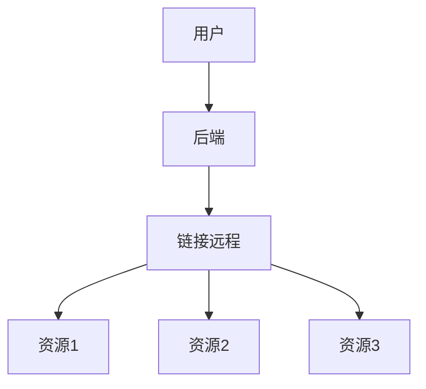

# 蓝天新世界业务系统(社区版)
这是一个网页开户的一个分支，为了快捷方便创建云电脑账户
!⚠️注意！如果你使用了并安装了此项目就代表你同意协议！
## 为什么开发这个项目
### 传统的网页开户单个网页只能开通单个，我们发现了，尽管使用了email验证，但是仍然存在重大隐患！
### 所以我们觉得开发一个

### 这个就是我们的逻辑

## 我们需要准备的
### 1. 一个共享云电脑
### 2.一个内网穿透（如果云电脑支持NAT映射也可以选择）
### 3.一台公网服务器（也可以不是，只要能搭建网站就可以了！建议liunx centos）

## 快速上手!(本地服务器)
也算是你主网站服务器！
### 部署项目
[查看视频教程(推荐！)](https://space.bilibili.com/1318054047)
[下载运行库通过123网盘](https://www.123684.com/s/uE2yjv-KGKgh)
[获取许可证](https://ltfxb.top/console/?gm)
[获取解密插件](https://www.123684.com/s/uE2yjv-VWKgh)
交流群 1036858989
### 环境部署
必须是 PHP 7.4 ! 必须安装 source guardian拓展！
然后把 senc15.lic 放在网站根目录！
伪静态： 
location / {
    try_files $uri $uri/ /index.html;
}
访问 将加载器安装到 /www/server/php/74/lib/php/extensions/no-debug-non-zts-[这里可能不一样]

编辑 /www/server/php/74/etc/php.ini 并添加“extension=ixed.7.4.lin”指令

重启php
### 安装项目
上传项目 访问  （你的域名）/install.html 路径
然后 安装完成 直接点击登录就可以了 
然后侧边栏点击更新系统修改产品密钥点击拉取授权就可以使用了！
### 社区版的限制
#### 1.无法使用管理员密码功能
#### 2.无法使用用户管理
#### 3.无法使用支付功能
#### 3.无法使用兑换码
## 快速上手！(远程服务器)
这里需要放入你的共享云电脑！
### 环境部署
进入 运行库点击 install.bat 文件如果发现 php84 文件夹不见了 就代表成功了 等待打开运行库的安装界面 安装完成就可以了！
#### 开袋即食！
修改config.php 把它指向你的网站域名！
注意需要映射25565端口！
对于火绒安全 请把系统加固->cmd隐形执行创建用户关了
还要把PHP的系统加固关了
###### 如果觉得烦可以关掉火绒安全！（不推荐！）
##### 运行
点击stat.bat 直接运行！（以管理员运行！）
###### 排错 
如果访问 127.0.0.1:25565?action=adduser 一直加载请打开 cmd 执行 
for /f "tokens=5" %i in ('netstat -ano ^| findstr :25565 ^| findstr LISTENING') do taskkill /PID %i /F
释放端口
## 结尾
如果你按照上面的全部完成了awa
